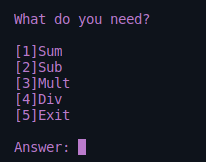
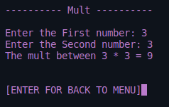
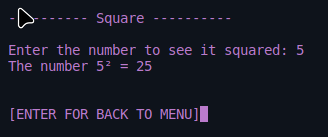
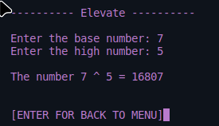
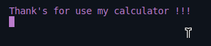
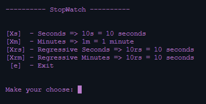
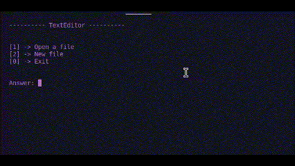
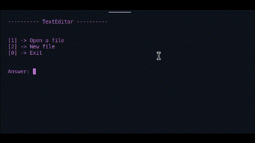

# Learning C# balta.io
Seguindo a ordem do Curso do Balta.io

- Linux Mint + VScode + C# dev kit
- Projetos tem a flag [-PROJEC] -> Total de Projetos [3]

Projects

    

        
Calculator

        <h1> Calculator </h1>
        
A project for put in pratice my skills in C# basics, with an emphasis on organizing functions and converting types.

         
        
<b>Menu</b>

        
        
<b>Example instruction</b>

        
        
<b>Square Exemple</b>

        
        
<b>Elevate yourself!!</b>

        
        
<b>Exiting</b>

        
    

    

        
StopWatch

        <h1> StopWatch</h1>
        
Put more basics skills, with an emphasis on organizing functions and converting types, thread/sleep, loops, return functions and more...

         
        
<b>Running</b> from smallest to largest

        
        
<b>Running</b> from largest to smallest

        
        
<b>Menu</b>

        
    

    

        
TextEditor

        <h1> TextEditor</h1>
        
Work with Write and Read Files, functions, loops, and more....

         
        
<b>Edit File</b> / Create File

        
        
<b>Open File</b>

        
        
<b>Exit</b>

        
    

